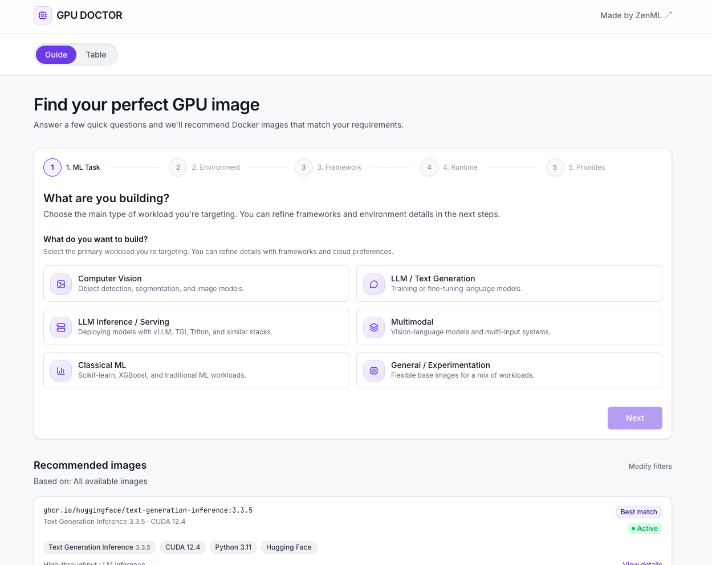
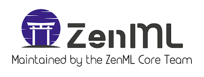

# GPU Doctor



A curated catalog of ML Docker base images to help engineers escape "CUDA hell" and choose the right container for their GPU workloads.

## The Problem

Selecting a Docker base image for ML is painful:
- CUDA/cuDNN version matrices are confusing
- Image sizes range from 1GB to 20GB+ with unclear trade-offs
- Documentation is scattered across NVIDIA, cloud providers, and framework maintainers
- Security scan data is hard to find

## The Solution

GPU Doctor provides:
- **Structured catalog** of vetted ML images (PyTorch, TensorFlow, vLLM, TGI, Triton, etc.)
- **Consistent metadata** including CUDA versions, driver requirements, sizes, and security ratings
- **Guided picker** to find the right image for your use case
- **Searchable table** with filtering by framework, role, and cloud affinity

## Quick Start

```bash
# Browse the catalog
cat data/images.json | jq '.images[] | {id, name, role: .capabilities.role}'

# Validate after edits
.venv/bin/python -c "
import json
from jsonschema import validate
with open('data/schema.json') as f: schema = json.load(f)
with open('data/images.json') as f: data = json.load(f)
validate(instance=data, schema=schema)
print('Valid')
"
```

## Project Status

- [x] JSON Schema design
- [x] Comprehensive catalog (200+ images covering PyTorch, TensorFlow, vLLM, TGI, Ollama, CUDA bases, NGC images for JAX, NeMo, Triton, and more)
- [x] Website with guided picker (5-step wizard) and table view
- [x] CI automation for catalog updates from registries
- [ ] Security scan enrichment (Trivy integration)
- [ ] Claude skill for recommendations

## Catalog Automation

The catalog is automatically updated from container registries:

```bash
# Install dependencies
pip install -r scripts/requirements.txt

# Dry-run (preview changes without writing)
python scripts/update_catalog.py --dry-run --source all

# Update from all registries (Docker Hub, GHCR, NGC)
python scripts/update_catalog.py --source all

# Update from a specific registry
python scripts/update_catalog.py --source dockerhub
```

**How it works:**
- `data/tracked_images.yaml` defines which images to track
- The script fetches metadata from registries, parses tags, and builds catalog entries
- Curated fields (`notes`, `recommended_for`, etc.) are preserved during updates
- A GitHub Actions workflow runs weekly and creates PRs with updates

## Website

The website is a Next.js app in `web/`:

```bash
cd web
yarn install
yarn dev
```

**Pages:**
- `/guide` - 5-step wizard to find the right image based on workload, environment, frameworks, and priorities
- `/table` - Searchable/filterable table of all images
- `/images/[id]` - Detailed view of a single image with specs, security info, and quick-start commands

[](https://github.com/zenml-io/zenml)
